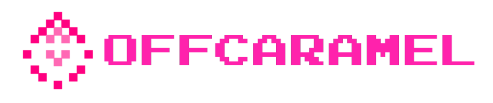

# OffCaramel by While(1) Studios


<div align="center">
  
  <h3>Advanced Medical AI Platform & Interactive IoT Gaming Experience</h3>
</div>

## 🌟 Overview

OffCaramel is an innovative dual-project initiative that combines cutting-edge medical AI technology with interactive IoT gaming:

1. **Medical AI Platform**: A comprehensive healthcare analysis system using advanced AI models for disease detection and diagnosis.
2. **IoT Hardware Game**: An offline interactive gaming experience that combines physical hardware with digital challenges.

## 📸 Screenshots

### Medical AI Platform Interface
<div align="center">
  
  <p><i>OffCaramel's modern, user-friendly medical analysis interface with real-time AI detection</i></p>
</div>

## 🏥 Medical AI Platform Features

### Disease Detection Models
- 🧠 Brain Tumor Analysis
- 👁️ Eye Disease Detection
- 👁️ Diabetic Retinopathy Analysis
- 👁️ Eye Diabetic Detection
- 💅 Nail Diabetic Analysis
- 👅 Tongue Diabetic Analysis
- 🦶 Foot Ulcer Diabetic Analysis

### Key Features
- **Real-Time Analysis**
  - Instant AI detection
  - High accuracy results
  - Visual indicators
- **AI Assistant**
  - Medical guidance
  - Health recommendations
  - Multi-language support
- **Additional Tools**
  - Hospital Locator
  - Report Generator
  - Emergency Contacts

## 🎮 IoT Hardware Game

### Overview
An offline interactive gaming experience that combines:
- Physical hardware components
- Digital challenges
- Real-time interaction
- LED-based feedback system

### Hardware Components
- Custom PCB design
- LED matrix display
- Touch sensors
- Motion sensors
- Sound feedback system

## 🛠️ Technical Stack

### Medical AI Platform
- **Frontend**: Streamlit
- **AI Models**: YOLOv8, Google Generative AI
- **Backend**: Python, Supabase
- **Image Processing**: OpenCV, Pillow
- **Additional Libraries**:
  - Ultralytics
  - Folium (Maps)
  - Deep Translator
  - Speech Recognition

### IoT Game
- **Hardware**:
  - Custom PCB
  - LED Matrix
  - Sensors
- **Software**:
  - C++ for hardware control
  - Python for game logic
  - Custom firmware

## 📋 Requirements

### Medical AI Platform
```bash
pip install -r requirements.txt
```

Key dependencies:
- streamlit==1.31.0
- ultralytics==8.1.0
- opencv-python==4.9.0.80
- google-generativeai==0.3.2
- torch==2.2.0

### IoT Game
- Arduino IDE
- Custom PCB components
- LED Matrix controller
- Sensor modules

## 🚀 Getting Started

### Medical AI Platform
1. Clone the repository
```bash
git clone https://github.com/yourusername/offcaramel.git
cd offcaramel
```

2. Install dependencies
```bash
pip install -r requirements.txt
```

3. Run the application
```bash
streamlit run login.py
```

### IoT Game Setup
1. Hardware assembly (instructions in hardware documentation)
2. Upload firmware using Arduino IDE
3. Connect sensors and LED matrix
4. Power up and calibrate

## 👥 User Roles

### Medical Platform
1. **Patient Access**
   - Disease detection
   - Health monitoring
   - Report generation

2. **Doctor Dashboard**
   - Patient management
   - Analysis results
   - Medical records

3. **Guest Mode**
   - Basic analysis features
   - Limited functionality

## 🔒 Security Features

- Email verification
- OTP authentication
- Role-based access control
- Secure data storage
- Encrypted communication

## 📞 Support

- **Email**: support@offcaramel.com
- **Emergency**: 108
- **Hospital**: +91-40-66660376

## ⚠️ Disclaimer

This is an AI-powered tool for initial screening only. Always consult healthcare professionals for medical advice and diagnosis.

## 🤝 Contributing

We welcome contributions! Please read our contributing guidelines before submitting pull requests.

## 📄 License

This project is licensed under the MIT License - see the LICENSE file for details.

## 🙏 Acknowledgments

- While(1) Studios Team
- Medical Advisors
- Hardware Development Partners
- Open Source Community

---
<div align="center">
  Made with ❤️ by While(1) Studios
</div> 